# Seq2PKS

Discovering modular type I Cis-AT polyketide natural products by integrating computational mass spectrometry and genome mining

## Seq2PKS web server

The web server for Seq2PKS is available at [https://run.npanalysis.org/](https://run.npanalysis.org/). Guidelines for using the server are shown below. The test data for the web server is included in the folder **server_sample_input**.

The Seq2PKS pipeline requires paired genomic and mass spectrometry data. After getting to the landing page, proceed to the Dashboard.

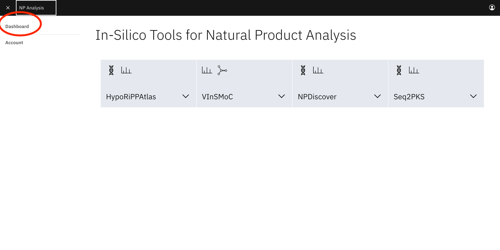

First, the user will need to create the user account.

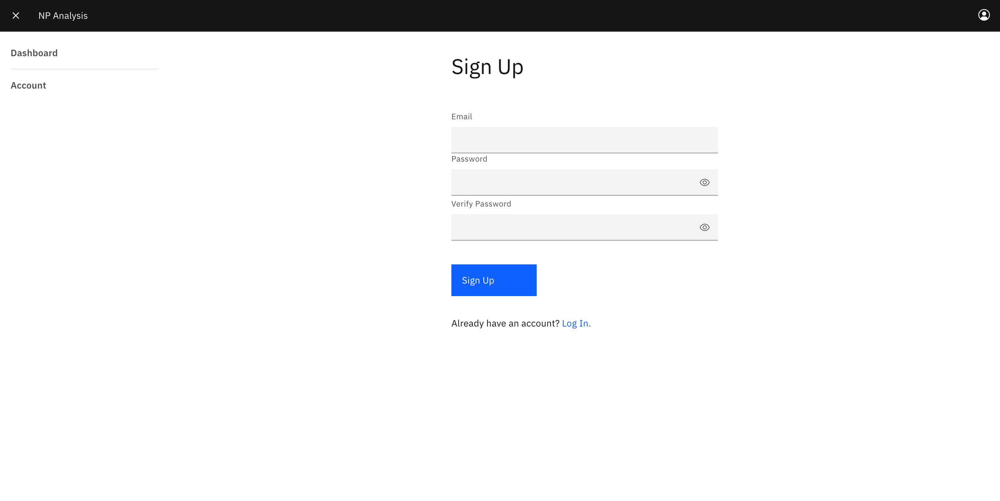

Once the user logs in, they will be directed to the Dashboard page, where they should upload genome data and paired mass spectrometry data. Currently, we do not support Seq2PKS runs without paired mass spectrometry data, due to the high costs associated with large data streaming. To upload data, click on the Data tab, click the plus icon, select the type of data, and upload the file. The contents of the data are processed for use in downstream analysis, and the raw files are not used after this processing step.

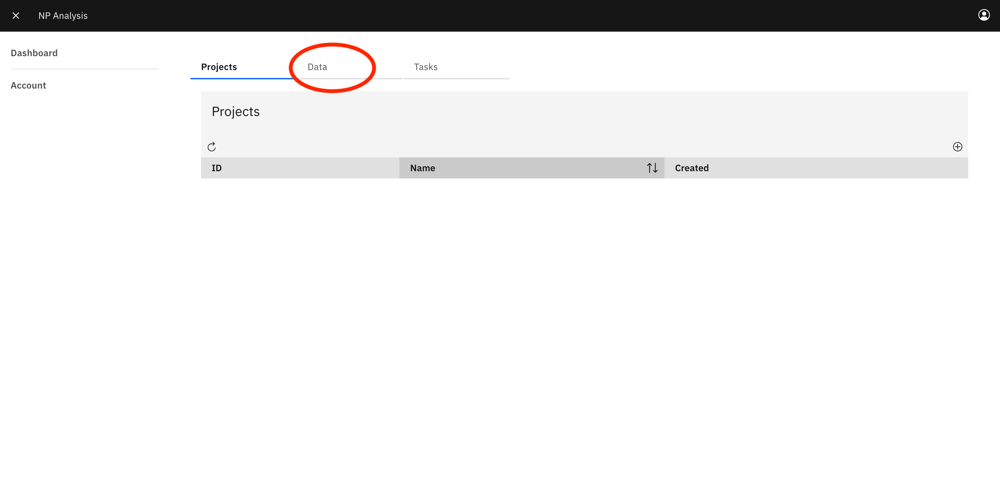

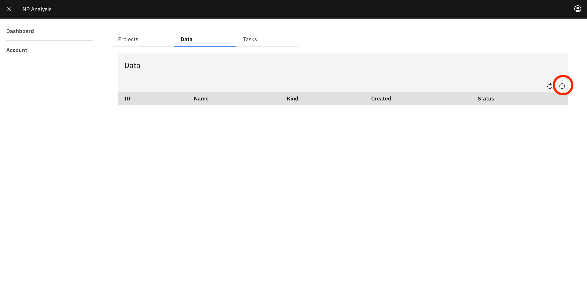

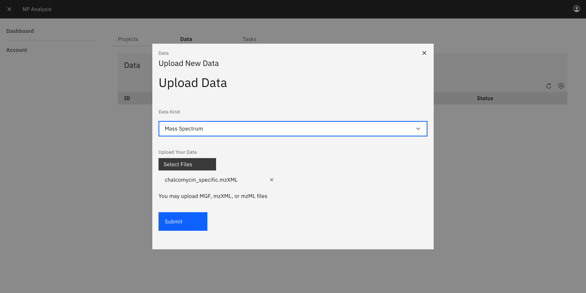

After uploading the data, it will appear under the Data tab.

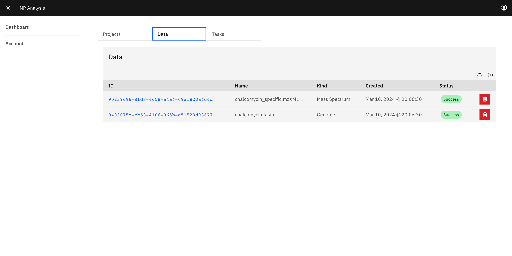

To start a new PKS workflow, the user can click on the dashboard tab. To create a new project, click the plus icon.

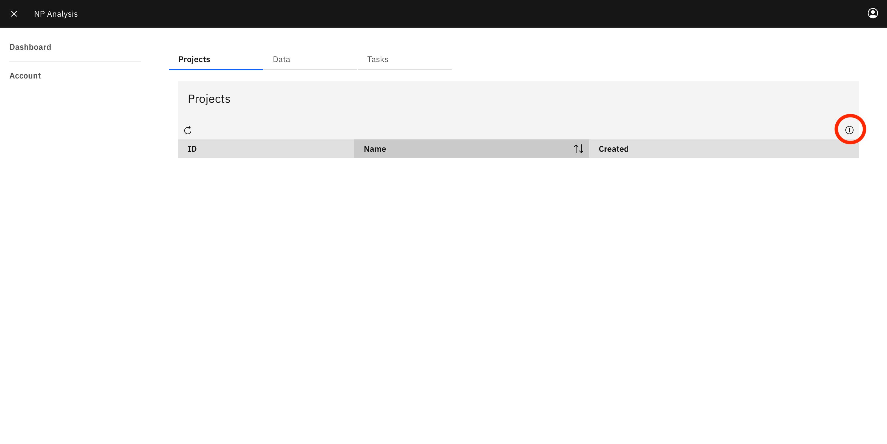

Next, to use the uploaded data in a project, the user should click on the project they created and link the data to the project. 

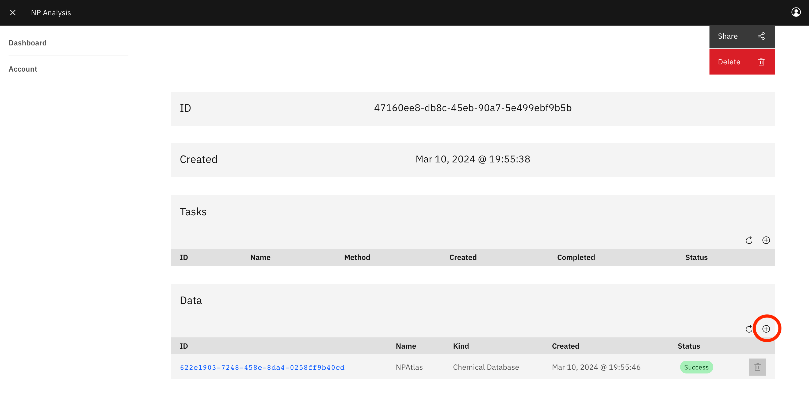

Upon linking the data, it will appear in the Data section under the project. Now the user can submit a new Seq2PKS task using their data

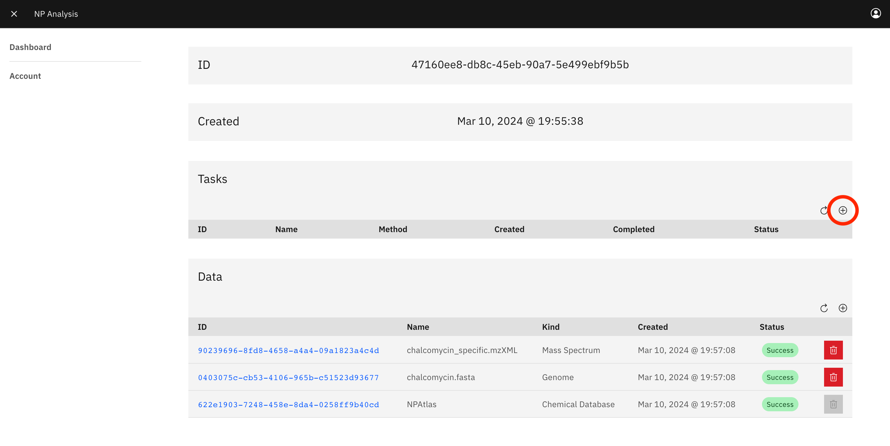

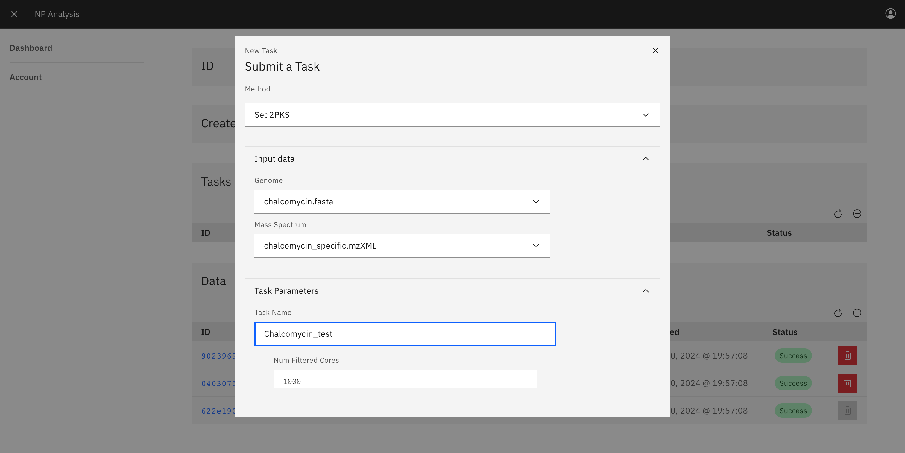

Here the user can input several different parameters, which are described below:

| Parameter                 | Description                                                                                         |
|---------------------------|-----------------------------------------------------------------------------------------------------|
| **Number of Filtered Cores** | A hard maximum on the number of PK core structures to consider in downstream analysis.             |
| **Ion Mode**                | Possible ion modes for the input spectra, either positive or negative.                             |
| **Precursor Ion Tolerance** | Absolute error tolerance when matching precursor ions to molecules.                                |
| **Product Ion Tolerance**   | Absolute error tolerance when matching peaks to theoretical fragments.                             |
| **Max Absolute Charge**     | The maximum absolute charge, used to pick adducts.                                                  |
| **Minimum Score**           | The minimum score for a molecule-spectrum match to be considered. Hits with scores lower than this will be silently discarded. |

To submit the task, scroll down and click the Submit button. After the task is completed, the user can click on the task ID in the Tasks section of the project page to view the results of the task.

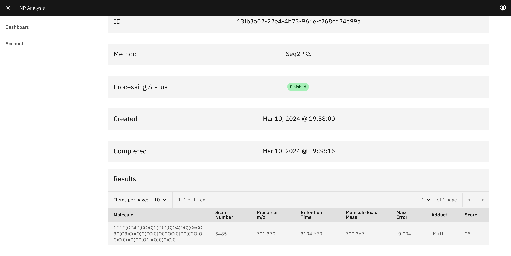

The results presented above were generated using the sample Chalcomycin BGC sequence and the corresponding mass spectrometry data as inputs. Given that this was conducted for testing purposes, the mass spectrum included only one scan that matched to Chalcomycin.

## Seq2PKS pipeline

Below is the description of the Seq2PKS pipeline for Linux users, outlining how to obtain results from its various steps. The pipeline comprises five principal steps:


### Detect polyketide Biosynthetic gene clusters (BGCs), Modules and Domains

This step involves using antiSMASH to identify polyketide biosynthetic gene clusters (BGCs), modules, and domains. The corresponding code is located in the **genome2genes** folder. When an NCBI ID is provided as input, Seq2PKS initially employs the esearch tool to download the relevant sequence. In cases where a sequence is directly provided, it is processed using the installed version of antiSMASH. The result from antiSMASH will be stored in the folder **antismash_result**. Once the antiSMASH analysis is complete, Seq2PKS parses the output to retain only essential information for subsequent steps. The refined output from antiSMASH is stored within the **parsed_result** folder, located in the results directory.

### Identify AT domain specificity 

In this step, a pre-trained machine learning model is employed to ascertain the AT domain specificity across all AT domains within each BGC. Relevant code for this process can be found in the **genome2genes** folder. Initially, the signature of each AT domain is extracted through alignment with a reference sequence. Subsequently, this signature is input into the model to generate the predicted results. The outcomes of this step are stored in the **specificity_result** folder.

### Predict structure order

In this step, we predict the assembly sequence of monomers recruited by each gene in the biosynthetic gene cluster (BGC). The code pertinent to this procedure is located in the **genes2domains** folder. The process begins with the extraction of the docking domain sequences from each gene. These sequences are then input into the model, which ranks all potential pathways. The ranked pathways are essential for constructing the molecular backbone. The outcomes of this step are stored in the **rank** folder.

### Construct backbone

In this step, AT domain specificity is merged with information from other domains to identify the mature monomers corresponding to each module, using a rule-based model. These monomers are then sequentially linked to create the backbone, adhering to the assembly order predicted in the preceding step. The code relevant to this process is housed in the **domains2backbone** folder. The outcomes of this step are compiled and stored in the **backbone** folder.

### Apply post-modification and score against the input spectrum file. 

In this step, post-modification genes responsible for various reactions are identified through HMM search. Subsequently, the corresponding modifications for each gene are applied to the molecular backbone using a graph-based model. The resulting candidate compounds are then scored against spectrums using tools like Dereplicator+ or Moldiscovery. The code relevant to this process is housed in the **backbone2pks** folder. The results for this step are being stored in the folder **compound**.

## Installing Seq2PKS locally

### Pre-built Docker image(Recommended)

This is the most straightforward way to install Seq2PKS. 

```
wget https://github.com/mohimanilab/Seq2PKS/main/docker/seq2pks.tar
sudo docker load -i seq2pks.tar
```

### Manually install on Unix-based system(Not recommended)

#### Installing Other Dependencies

If not present, you will also need to install the following:

- [ncbi-blast+](https://blast.ncbi.nlm.nih.gov/doc/blast-help/downloadblastdata.html#downloadblastdata)

For example, on Ubuntu,

```
sudo apt-get install NCBI-blast+
```

- [singularity](https://github.com/sylabs/singularity/releases)

Follow the [instructions](https://docs.sylabs.io/guides/4.0/user-guide/quick_start.html) to install it.

#### Local environment

The below packages are needed along with Python.

* `git`
* `pandas`
* `numpy`
* `rdkit`
* `antismash`
* `scikit-learn`
* `biopython`

For example, using `conda,`

```
conda create -n "Seq2PKS" pandas numpy rdkit antismash scikit-learn biopython -c conda-forge -c bioconda
conda activate Seq2PKS
git clone https://github.com/mohimanilab/Seq2PKS.git
```

Or using `mamba`, if the process is being killed when installing `antismash` package.

```
conda install mamba
mamba create -n "Seq2PKS" pandas numpy rdkit antismash scikit-learn biopython -c conda-forge -c bioconda
conda activate Seq2PKS
git clone https://github.com/mohimanilab/Seq2PKS.git
```

## Running Seq2PKS

Seq2PKS currently can take either NCBI ID or fasta file as input. Here are the input parameters for the software.

* `ncbi_id` ncbi_id for the input sequence
* `sequence_file` path to the sequence file
* `sequence_id` name for the sequence file
* `output_folder` output folder to store the result
* `spectrum_path` path to the spectrum file
* `pattern` algorithm for spectrum matching, can take "moldiscovery" or "dereplicator+" as input
* `n_jobs` Number of parallel jobs during computation
* `smile_compound`: Expected SMILE string for the compound if known

### Docker(Recommended)

Create your working directory,

```
mkdir Seq2PKS
cd Seq2PKS
```

Interacting with the container,

```
sudo docker run -it -v $(pwd):/usr/src/app/mnt --privileged --entrypoint /bin/bash seq2pks
```

Below is an example of how to run the tool using a FASTA file and an MZ file as inputs:

```
cp /path/to/source/{sample.fasta,sample_spectra.mzML} .
python main.py --sequence_file sample.fasta --sequence_id sample --pattern dereplicator_plus --spectrum_path sample_spectra.mzML --output_folder ./mnt/result
```

We have the sample run result included in the "test_result" folder for testing purposes. You should be able to generate the exact same result in the folder by following the below command,

```
python main.py --ncbi_id DQ149987.1 --pattern dereplicator_plus --spectrum_path sample_spectram.mzML --smile_compound 'CC=1CC(C)C(O)C(CC)C(O)C(C)C=C(C)C=C(OC)C(=O)OC(C(C(C(C3(O)CC(C(C(C=CC)O3)C)OC2OC(C(OC(=O)N)C(O)C2)C)C)O)C)C(C=CC=1)OC' --output_folder test_result
cp -r test_result mnt
```

The identified compounds are stored in the file "test_result/DQ149987/compound/backbone2pks_result/database.csv". 
The generated compounds are scored against the input spectrum file using dereplicator+, the obtained match is stored in "test_result/DQ149987/compound/backbone2pks_result/psms.tsv".

### Unix-based system(Not recommended)

Here is an example of running with a FASTA file as input:

```
cd Seq2PKS
cp /path/to/source/{sample.fasta,sample_spectra.mzML} .
python main.py --sequence_file sample.fasta --sequence_id sample --pattern dereplicator_plus --spectrum_path sample_spectra.mzML --output_folder result
```

We have the sample run result included in the "test_result" folder for testing purposes. By executing the following command, you should achieve the same results, which are stored in the **test_result** folder:

```
python main.py --ncbi_id DQ149987.1 --pattern dereplicator_plus --spectrum_path sample_spectram.mzML --smile_compound 'CC=1CC(C)C(O)C(CC)C(O)C(C)C=C(C)C=C(OC)C(=O)OC(C(C(C(C3(O)CC(C(C(C=CC)O3)C)OC2OC(C(OC(=O)N)C(O)C2)C)C)O)C)C(C=CC=1)OC' --output_folder test_result
```

The identified compounds are stored in the file "test_result/DQ149987/compound/backbone2pks_result/database.csv". 
The generated compounds are scored against the input spectrum file using dereplicator+, the obtained match is stored in "test_result/DQ149987/compound/backbone2pks_result/psms.tsv".
